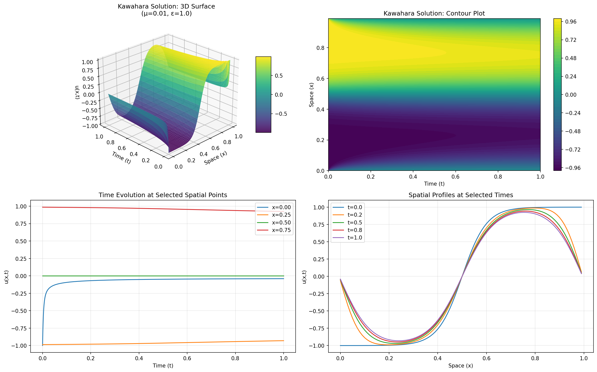

# Allen-Cahn PDE Solver (JAX Implementation)

A compact and efficient Python implementation of the Allen-Cahn equation solver using JAX, converted from Julia code implementation in [PolynomialModelReduction.jl](https://github.com/smallpondtom/PolynomialModelReductionDataset.jl/blob/main/src/1D/AllenCahn.jl). Additional resources are in this [doc](https://smallpondtom.github.io/PolynomialModelReductionDataset.jl/stable/1D/allencahn/).



## Overview

This implementation solves the Allen-Cahn equation:

```
∂u/∂t = μ∂²u/∂x² - ε(u³ - u)
```

where:
- `u(x,t)` is the state variable (e.g., phase field)
- `μ` is the diffusion coefficient
- `ε` is the nonlinear coefficient

## Key Features

✅ **Compact & Readable**: ~400 lines of clean, well-documented code  
✅ **Mathematically Correct**: Proper unique cubic Kronecker product (matches Julia's UniqueKronecker.jl)  
✅ **JAX-Powered**: JIT compilation for speed, GPU-ready  
✅ **Two Time Integrators**:
   - SICN (Semi-Implicit Crank-Nicolson)
   - CNAB (Crank-Nicolson Adams-Bashforth) - 2nd order accurate
✅ **Periodic Boundary Conditions**  
✅ **Efficient Cubic Operator**: Eliminates redundancies, computes all unique products u[i]×u[j]×u[k] where i≤j≤k

## Installation

```bash
pip install jax jaxlib numpy matplotlib
```

For GPU support:
```bash
pip install jax[cuda12]  # or jax[cuda11]
```

## Running the code

```bash
pixi run python allen_cahn_jax.py
```

## Algorithm Details

### Time Integration Schemes

**SICN (Semi-Implicit Crank-Nicolson)**:
- Linear terms: Implicit (Crank-Nicolson)
- Nonlinear terms: Explicit
- 1st order accurate in time
- Unconditionally stable for linear part

**CNAB (Crank-Nicolson Adams-Bashforth)**:
- Linear terms: Implicit (Crank-Nicolson)  
- Nonlinear terms: Adams-Bashforth extrapolation
- 2nd order accurate in time
- Better accuracy than SICN

### Spatial Discretization

- Finite differences on uniform grid
- 2nd order centered differences for Laplacian
- Periodic boundary conditions via circulant matrix structure

### Cubic Nonlinearity

The cubic term `u³` is handled using the **unique cubic Kronecker product** that eliminates redundancies:
- Full 3D tensor would be `O(N³)` 
- Unique product representation is `O(N²)` with only `S = N(N+1)(N+2)/6` terms
- Computes all unique products `u[i]*u[j]*u[k]` where `i ≤ j ≤ k`
- The E matrix selects diagonal terms `(i,i,i)` corresponding to `u[i]³`

**Example**: For `u = [1, 2, 3]`, the cubic Kronecker product produces 10 terms:
```
[1³, 1²×2, 1²×3, 1×2², 1×2×3, 1×3², 2³, 2²×3, 2×3², 3³]
= [1, 2, 3, 4, 6, 9, 8, 12, 18, 27]
```

See `CUBIC_KRONECKER_EXPLANATION.md` for detailed explanation.

## Example Use Cases

### Phase Separation
Models spinodal decomposition - random initial state evolves into distinct phases:
```python
solver = AllenCahnSolver(mu=0.001, epsilon=5.0)
u0 = example_initial_condition(solver.x, mode="random")
```

### Interface Dynamics
Sharp transition evolves and diffuses:
```python
solver = AllenCahnSolver(mu=0.01, epsilon=1.0)
u0 = example_initial_condition(solver.x, mode="tanh")
```

### Multiscale Patterns
```python
u0 = example_initial_condition(solver.x, mode="multiscale")
```

## Performance Tips

1. **Use JIT compilation** - already enabled with `@jit` decorators
2. **GPU acceleration** - JAX automatically uses GPU if available
3. **Constant time step** - slightly faster (already optimized in code)
4. **Return only final state** - set `return_all_steps=False` to save memory

## Mathematics

The Allen-Cahn equation is a reaction-diffusion PDE that models:
- Phase separation in binary alloys
- Interface motion in materials science
- Mean curvature flow (in certain limits)
- Gradient flows of the Ginzburg-Landau energy functional

The discretized system:
```
(I - Δt/2 A) u^{n+1} = (I + Δt/2 A) u^n + Δt E(u^n)³
```

where:
- `A`: linear operator (diffusion + reaction)
- `E`: cubic operator (nonlinear term)
- `I`: identity matrix

## Extending the Code

To add new boundary conditions:
1. Modify `_create_operators()` to handle new BC
2. Adjust spatial grid creation in `__init__()`
3. Update documentation

To add control inputs (as in original Julia):
1. Add `B` matrix (control operator) 
2. Modify time stepping to include `B @ u_input` term
3. See original Julia code for reference

## References

- Allen, S. M., & Cahn, J. W. (1979). "A microscopic theory for antiphase boundary motion and its application to antiphase domain coarsening"
- Evans, L. C. (1998). Partial Differential Equations (Chapter 7)
