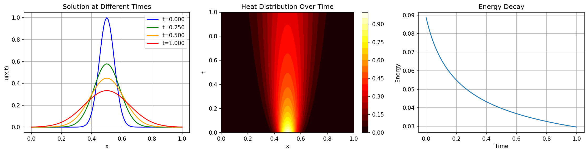
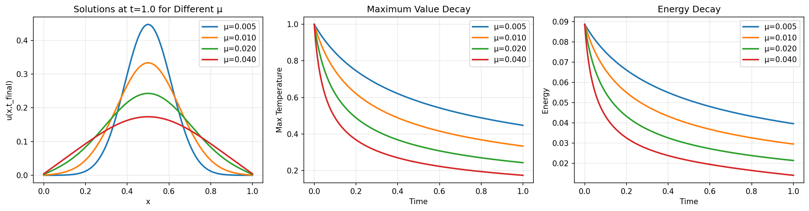
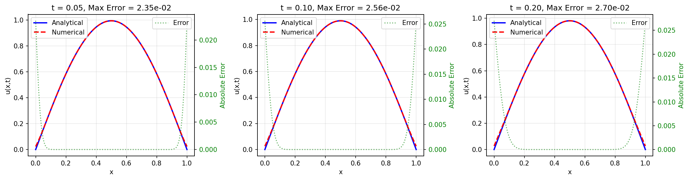

# 1D Heat Equation (JAX Implementation)

A JAX-based implementation of the 1D Heat Equation solver with multiple boundary conditions and integration schemes, converted from the original Julia code in 
[PolynomialModelReductionDataset.jl](https://github.com/smallpondtom/PolynomialModelReductionDataset.jl/blob/main/src/1D/Heat1D.jl). For more details,
see this [doc](https://smallpondtom.github.io/PolynomialModelReductionDataset.jl/stable/1D/heat1d/).





## Features

### Boundary Conditions
- **Periodic**: Solution wraps around at boundaries
- **Dirichlet**: Fixed values at boundaries
- **Neumann**: Fixed flux (derivative) at boundaries  
- **Mixed**: Combination of Neumann and Dirichlet
- **Robin**: Linear combination of value and derivative

### Integration Schemes
- **Forward Euler**: Explicit, simple but conditionally stable (r ≤ 0.5)
- **Backward Euler**: Implicit, unconditionally stable
- **Crank-Nicolson**: Semi-implicit, second-order accurate, unconditionally stable

### Key Capabilities
- JIT compilation for performance
- Vectorized operations using JAX
- Support for parameter sweeps
- Multiple initial condition generators
- Validation against analytical solutions

## Mathematical Formulation

The 1D heat equation:
```
∂u/∂t = μ ∂²u/∂x²
```

where:
- `u(x,t)` is the temperature/concentration
- `μ` is the diffusion coefficient
- `x` is the spatial coordinate
- `t` is time

## Usage Example

```python
import jax.numpy as jnp
from heat1d_jax import Heat1DModel, create_gaussian_ic

# Create model
model = Heat1DModel(
    spatial_domain=(0.0, 1.0),
    time_domain=(0.0, 0.5),
    dx=0.01,
    dt=0.0001,
    diffusion_coeffs=0.01,
    BC='dirichlet'
)

# Set initial condition
ic = create_gaussian_ic(model.xspan, center=0.5, width=0.1)
model.set_initial_condition(ic)

# Get finite difference operators
mu = 0.01
A, B = model.finite_diff_model(mu, same_on_both_ends=True)

# Set boundary conditions
boundary_values = jnp.zeros((1, model.time_dim))

# Integrate the model
solution = model.integrate_model(
    tdata=model.tspan,
    u0=model.IC,
    input_data=boundary_values,
    linear_matrix=A,
    control_matrix=B,
    system_input=True,
    integrator_type='CrankNicolson'
)
```

## Validation Tests

Run the examples file to see:
1. **All boundary conditions**: Visual comparison of different BC types
2. **Integration scheme comparison**: Forward Euler vs Backward Euler vs Crank-Nicolson
3. **Parameter sweeps**: Effects of varying diffusion coefficients
4. **Analytical validation**: Comparison with exact solutions
5. **Stability analysis**: Numerical stability for different time steps

```bash
pixi run python heat1d_jax.py
```

## Performance Considerations

- JIT compilation provides significant speedup for repeated calls
- For large spatial grids, consider using sparse matrix libraries (experimental in JAX)
- Forward Euler is fastest but requires small time steps for stability
- Crank-Nicolson provides best accuracy-to-cost ratio

## Stability Criteria

For Forward Euler, the stability criterion is:
```
r = μΔt/Δx² ≤ 0.5
```

Backward Euler and Crank-Nicolson are unconditionally stable but may still require small time steps for accuracy.

## Installation

```bash
pip install jax jaxlib numpy matplotlib
```

## References

- Original Julia implementation from smallpondtom/PolynomialModelReductionDataset.jl
- Finite difference methods for PDEs
- JAX documentation: https://jax.readthedocs.io/
