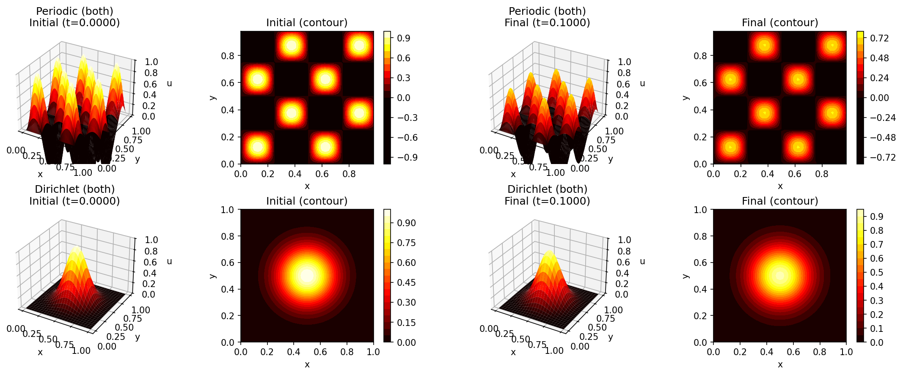
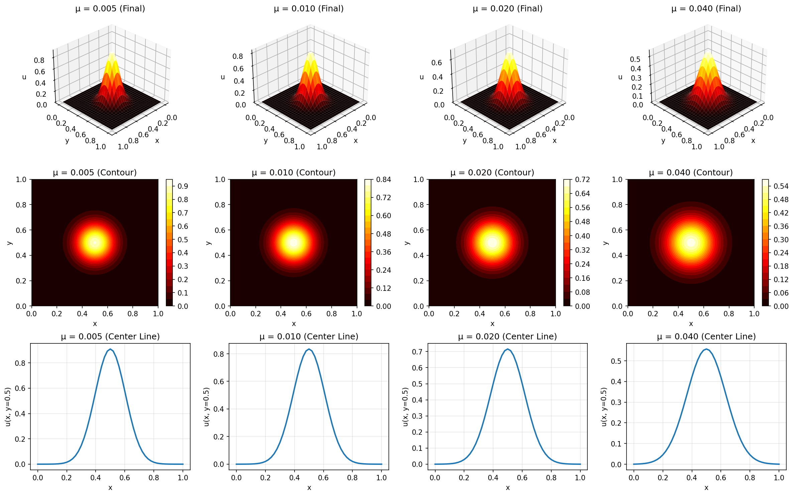
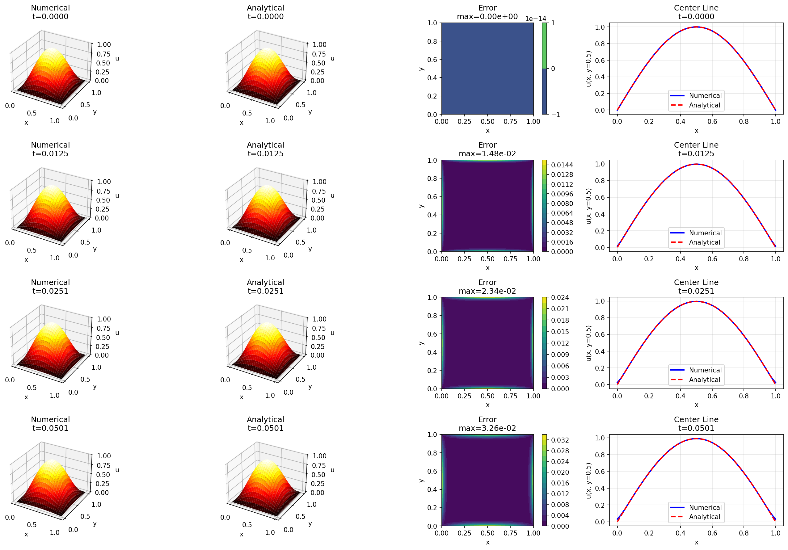

# 2D Heat Equation (JAX Implementation)

A JAX-based implementation of the 2D Heat Equation solver with multiple boundary conditions and integration schemes, converted from the original Julia code in [PolynomialModelReductionDataset.jl](https://github.com/smallpondtom/PolynomialModelReductionDataset.jl/blob/main/src/2D/Heat2D.jl).





## Features

### Boundary Conditions

- **Periodic**: Solution wraps around at boundaries (both x and y directions)
- **Dirichlet**: Fixed values at boundaries (both x and y directions)
- Support for mixed boundary conditions (different types in x and y directions) - *coming soon*

### Integration Schemes

- **Forward Euler**: Explicit, simple but conditionally stable (r ≤ 0.5)
- **Backward Euler**: Implicit, unconditionally stable
- **Crank-Nicolson**: Semi-implicit, second-order accurate, unconditionally stable

### Key Capabilities

- JIT compilation for performance
- Vectorized operations using JAX
- Support for parameter sweeps
- Multiple initial condition generators (Gaussian, sinusoidal, step functions)
- Validation against analytical solutions
- 2D visualization with surface and contour plots

## Mathematical Formulation

The 2D heat equation:

```plain
∂u/∂t = μ(∂²u/∂x² + ∂²u/∂y²)
```

where:

- `u(x,y,t)` is the temperature/concentration field
- `μ` is the diffusion coefficient
- `x, y` are the spatial coordinates
- `t` is time

The 2D Laplacian operator is constructed using Kronecker products:

```plain
L₂ᴰ = (Lʸ ⊗ Iˣ) + (Iʸ ⊗ Lˣ)
```

where `Lˣ` and `Lʸ` are 1D second-derivative operators and `Iˣ`, `Iʸ` are identity matrices.

## Installation

```bash
pip install jax jaxlib numpy matplotlib scipy
```

Note: `scipy` is used for sparse matrix construction (Kronecker products), which are then converted to dense JAX arrays.

## Usage Example

```python
import jax.numpy as jnp
from heat2d_jax import Heat2DModel, create_gaussian_ic_2d

# Create model
model = Heat2DModel(
    spatial_domain=((0.0, 1.0), (0.0, 1.0)),  # (x_domain, y_domain)
    time_domain=(0.0, 0.1),
    dx=0.02,
    dy=0.02,
    dt=0.0001,
    diffusion_coeffs=0.01,
    BC=('dirichlet', 'dirichlet')
)

# Create meshgrid for initial condition
X, Y = jnp.meshgrid(model.xspan, model.yspan, indexing='ij')

# Set Gaussian initial condition
ic_2d = create_gaussian_ic_2d(X, Y, center=(0.5, 0.5), width=0.1)
model.set_initial_condition(ic_2d)

# Solve the system
solution = model.solve(integrator='CrankNicolson')

# Reshape solution for visualization (Nx × Ny × time_steps)
sol_3d = model.reshape_solution(solution)
```

## Initial Condition Generators

### Gaussian

```python
from heat2d_jax import create_gaussian_ic_2d

X, Y = jnp.meshgrid(model.xspan, model.yspan, indexing='ij')
ic = create_gaussian_ic_2d(X, Y, center=(0.5, 0.5), width=0.1)
```

### Sinusoidal

```python
from heat2d_jax import create_sinusoidal_ic_2d

ic = create_sinusoidal_ic_2d(
    X, Y, 
    n_modes=(2, 2),  # modes in x and y directions
    x_domain=(0.0, 1.0),
    y_domain=(0.0, 1.0)
)
```

### Step Function

```python
from heat2d_jax import create_step_ic_2d

ic = create_step_ic_2d(
    X, Y,
    x_range=(0.3, 0.7),
    y_range=(0.3, 0.7)
)
```

## Boundary Conditions Setup

### Periodic Boundaries

```python
model = Heat2DModel(
    ...,
    BC=('periodic', 'periodic')
)

# No boundary data needed for periodic BC
solution = model.solve(integrator='CrankNicolson')
```

### Dirichlet Boundaries

```python
model = Heat2DModel(
    ...,
    BC=('dirichlet', 'dirichlet')
)

# Boundary data: [left, right, bottom, top]
# Shape: (4, time_steps)
boundary_data = jnp.zeros((4, model.time_dim))

# Or let the solver use default zero boundaries
solution = model.solve(integrator='CrankNicolson')
```

## Parameter Sweeps

```python
# Define multiple diffusion coefficients
mu_values = [0.01, 0.05, 0.1, 0.5]

# Solve for all parameters
solutions = model.solve_parameter_sweep(
    mu_values,
    integrator='CrankNicolson'
)

# Access individual solutions
for mu, solution in solutions.items():
    print(f"Solution for μ={mu}: max={jnp.max(solution):.4f}")
```

## Visualization Examples

### 3D Surface Plot

```python
import matplotlib.pyplot as plt
from mpl_toolkits.mplot3d import Axes3D

X, Y = jnp.meshgrid(model.xspan, model.yspan, indexing='ij')
sol_3d = model.reshape_solution(solution)

fig = plt.figure()
ax = fig.add_subplot(111, projection='3d')
ax.plot_surface(X, Y, sol_3d[:, :, -1], cmap='hot')
ax.set_xlabel('x')
ax.set_ylabel('y')
ax.set_zlabel('u')
plt.show()
```

### Contour Plot

```python
fig, ax = plt.subplots()
contour = ax.contourf(X, Y, sol_3d[:, :, -1], levels=20, cmap='hot')
plt.colorbar(contour)
ax.set_xlabel('x')
ax.set_ylabel('y')
ax.set_aspect('equal')
plt.show()
```

### Animation Over Time

```python
import matplotlib.animation as animation

fig = plt.figure()
ax = fig.add_subplot(111, projection='3d')

def update(frame):
    ax.clear()
    ax.plot_surface(X, Y, sol_3d[:, :, frame], cmap='hot')
    ax.set_xlabel('x')
    ax.set_ylabel('y')
    ax.set_zlabel('u')
    ax.set_title(f't = {model.tspan[frame]:.4f}')
    return []

ani = animation.FuncAnimation(fig, update, frames=model.time_dim, 
                             interval=50, blit=True)
plt.show()
```

## Validation Tests

Run the comprehensive examples file to see:

1. **Boundary condition comparison**: Visual comparison of periodic vs Dirichlet BCs
2. **Integration scheme comparison**: Forward Euler vs Backward Euler vs Crank-Nicolson
3. **Parameter sweeps**: Effects of varying diffusion coefficients
4. **Analytical validation**: Comparison with exact solutions for special cases
5. **Different initial conditions**: Gaussian, step, and sinusoidal patterns

```bash
python heat2d_examples.py
```

This will generate 8 comprehensive figures demonstrating all capabilities.

## Performance Considerations

### Memory Usage

- Grid size scales as Nx × Ny
- For a 50×50 grid: ~2,500 points
- For a 100×100 grid: ~10,000 points
- Memory usage is O(Nx × Ny × time_steps)

### Computational Complexity

- Each time step requires solving a linear system
- Forward Euler: O(N²) per step (matrix-vector multiply)
- Backward Euler & Crank-Nicolson: O(N³) per step (linear solve)
  - Where N = Nx × Ny
- JIT compilation provides 10-100× speedup after first run

### Optimization Tips

1. **Use Crank-Nicolson** for best accuracy-to-cost ratio
2. **Cache operators** when solving with same parameters multiple times
3. **Use coarser grids** for initial exploration, then refine
4. **Consider sparse solvers** for very large grids (>100×100)

## Stability Criteria

For Forward Euler, the stability criterion is:

```plain
r = μΔt/(min(Δx², Δy²)) ≤ 0.5
```

For a square grid with Δx = Δy:

```plain
Δt ≤ Δx²/(2μ)
```

**Example**: For μ = 0.01 and Δx = 0.02:
- Stable: Δt ≤ 0.0002
- Unstable: Δt > 0.0002

Backward Euler and Crank-Nicolson are unconditionally stable but may still require small time steps for accuracy.

## Analytical Solutions

For validation, the following analytical solutions are available:

### Zero Dirichlet BC with Sinusoidal IC

Initial condition: `u(x,y,0) = sin(πx)sin(πy)` on [0,1]×[0,1]

Analytical solution:

```plain
u(x,y,t) = sin(πx)sin(πy)exp(-2π²μt)
```

This solution decays exponentially with rate proportional to μ.

### Implementation

```python
def analytical_solution_2d_dirichlet(X, Y, t, mu):
    return jnp.sin(jnp.pi * X) * jnp.sin(jnp.pi * Y) * jnp.exp(-2 * jnp.pi**2 * mu * t)
```

## Differences from 1D Implementation

| Feature | 1D | 2D |
|---------|----|----|
| Spatial dimensions | (Nx,) | (Nx, Ny) |
| Laplacian construction | Tridiagonal matrix | Kronecker sum |
| Boundary inputs (Dirichlet) | 2 (left, right) | 4 (left, right, bottom, top) |
| Grid points | Nx | Nx × Ny |
| Memory scaling | O(Nx) | O(Nx × Ny) |
| Compute scaling | O(Nx²) | O((Nx × Ny)²) |

## Common Issues and Solutions

### Issue: "Out of memory" error

**Solution**: Reduce grid resolution or time steps
```python
# Instead of dx=0.01, dy=0.01
dx = 0.02  # Coarser grid
dy = 0.02
```

### Issue: Numerical instability with Forward Euler

**Solution**: Check stability criterion or switch integrators
```python
# Check stability
r = mu * dt / min(dx**2, dy**2)
print(f"Stability parameter: {r:.4f} (should be ≤ 0.5)")

# Or use stable integrator
solution = model.solve(integrator='CrankNicolson')
```

### Issue: Solution doesn't match expected behavior

**Solution**: Verify initial conditions and boundary data
```python
# Visualize initial condition
import matplotlib.pyplot as plt
plt.figure()
plt.contourf(X, Y, ic_2d)
plt.colorbar()
plt.title('Initial Condition')
plt.show()
```

## API Reference

### Heat2DModel

```python
class Heat2DModel(
    spatial_domain: Tuple[Tuple[float, float], Tuple[float, float]],
    time_domain: Tuple[float, float],
    dx: float,
    dy: float,
    dt: float,
    diffusion_coeffs: Union[float, np.ndarray],
    BC: Tuple[str, str] = ('dirichlet', 'dirichlet')
)
```

**Methods**:
- `set_initial_condition(IC)`: Set initial condition (1D or 2D array)
- `update_parameter(mu)`: Update diffusion coefficient
- `finite_diff_model(mu)`: Get system matrices A and B
- `integrate_model(...)`: Low-level integration function
- `solve(...)`: High-level solve function
- `solve_parameter_sweep(mu_values, ...)`: Solve for multiple parameters
- `reshape_solution(solution)`: Convert flat solution to 3D array

## References

- Original Julia implementation: [PolynomialModelReductionDataset.jl](https://github.com/smallpondtom/PolynomialModelReductionDataset.jl)
- Finite difference methods for PDEs
- LeVeque, R. J. (2007). Finite Difference Methods for Ordinary and Partial Differential Equations
- JAX documentation: [https://jax.readthedocs.io/](https://jax.readthedocs.io/)

<!-- ## Citation

If you use this code in your research, please cite:

```bibtex
@software{heat2d_jax,
  title = {2D Heat Equation JAX Implementation},
  author = {Converted from PolynomialModelReductionDataset.jl},
  year = {2024},
  url = {https://github.com/smallpondtom/PolynomialModelReductionDataset.jl}
}
```

## License

This implementation follows the same license as the original Julia package.

## Contributing

Contributions are welcome! Areas for improvement:

- [ ] Additional boundary conditions (Neumann, Robin, mixed)
- [ ] Adaptive time stepping
- [ ] Sparse matrix support for larger grids
- [ ] GPU acceleration benchmarks
- [ ] Non-uniform grids
- [ ] Time-dependent boundary conditions
- [ ] Nonlinear diffusion coefficients

## Changelog

### Version 1.0.0
- Initial JAX implementation
- Periodic and Dirichlet boundary conditions
- Forward Euler, Backward Euler, Crank-Nicolson integrators
- Parameter sweep functionality
- Comprehensive examples and validation tests
- Analytical solution validation
- Multiple initial condition generators -->
