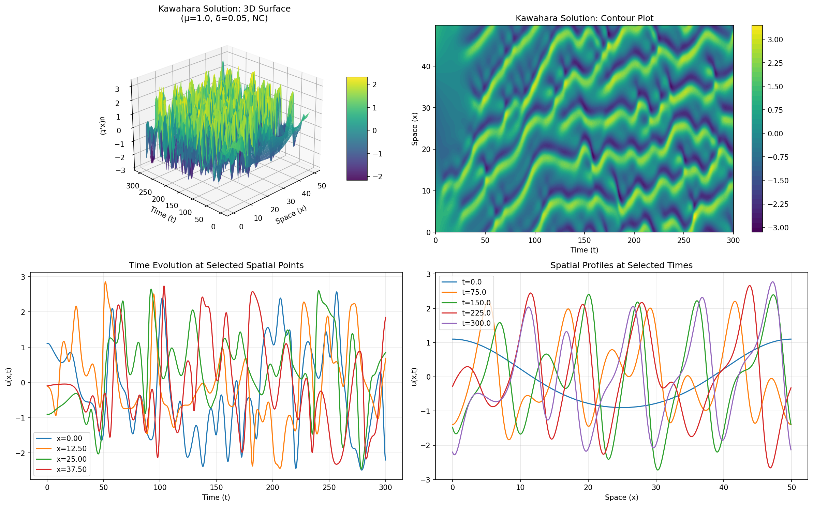
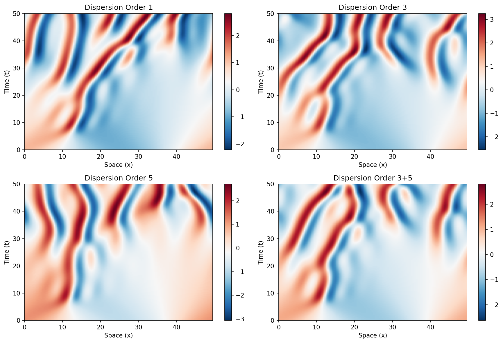
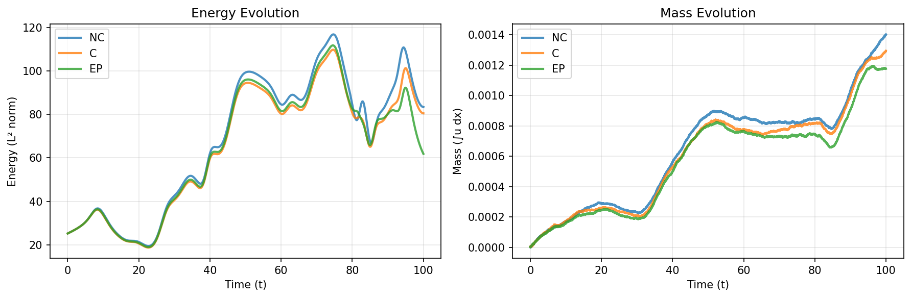

# Kawahara Equation Solver (JAX Implementation)

A compact and efficient Python implementation of the Kawahara (dispersively-modified Kuramoto-Sivashinsky) equation solver using JAX.





## Overview

The Kawahara equation is a nonlinear PDE that combines:

- 4th-order diffusion
- 2nd-order anti-diffusion  
- Nonlinear advection
- Dispersion

**Dispersion Order 1:**

```plain
∂u/∂t = -μ∂⁴u/∂x⁴ - ∂²u/∂x² - u∂u/∂x - δ∂u/∂x
```

**Dispersion Order 3:**

```plain
∂u/∂t = -μ∂⁴u/∂x⁴ - ∂²u/∂x² - u∂u/∂x - δ∂³u/∂x³
```

**Dispersion Order 5:**

```plain
∂u/∂t = -μ∂⁴u/∂x⁴ - ∂²u/∂x² - u∂u/∂x - ν∂⁵u/∂x⁵
```

**Dispersion Order 3+5=8:**

```plain
∂u/∂t = -μ∂⁴u/∂x⁴ - ∂²u/∂x² - u∂u/∂x - δ∂³u/∂x³ - ν∂⁵u/∂x⁵
```

where:

- `u(x,t)`: state variable
- `μ`: viscosity coefficient (4th-order diffusion)
- `δ`: dispersion coefficient (1st or 3rd-order)
- `ν`: higher-order dispersion coefficient (5th-order)

## Key Features

✅ **Dynamic Parameter Updates**: Change μ, δ, ν, conservation type, or dispersion order anytime  
✅ **Three Conservation Formulations**:

- **NC**: Non-conservative (standard form)
- **C**: Conservative (mass-preserving)
- **EP**: Energy-preserving

✅ **Two Dispersion Orders**: 1st, 3rd, 5th, 3rd and 5th order spatial derivatives  
✅ **JAX-Powered**: JIT compilation, GPU-ready  
✅ **Crank-Nicolson Adams-Bashforth**: 2nd-order accurate time integration  
✅ **Unique Quadratic Kronecker Product**: Efficient handling of u∂u/∂x term  
✅ **Periodic Boundary Conditions**

## Installation

```bash
pixi shell 
```

For GPU support:

```bash
pixi shell --environment cuda
```

## Dynamic Parameter Updates

One of the key features is the ability to update parameters after initialization:

```python
# Create solver with initial parameters
solver = KawaharaSolver(mu=1.0, delta=0.15, conservation_type='NC')

# Solve with initial parameters
u1 = solver.solve(u0)

# Update parameters - changes reflected immediately
solver.update_parameters(mu=0.5)              # Change viscosity
solver.update_parameters(delta=0.3)           # Change dispersion  
solver.update_parameters(conservation_type='EP')  # Change formulation
solver.update_parameters(dispersion_order=3)  # Change dispersion order

# Solve again with new parameters
u2 = solver.solve(u0)
```

## Conservation Types

### NC (Non-Conservative)

Standard centered difference for -u∂u/∂x:

```python
solver = KawaharaSolver(conservation_type='NC')
```

- Simple and fast
- No conservation guarantees

### C (Conservative)

Mass-preserving formulation:

```python
solver = KawaharaSolver(conservation_type='C')
```

- Preserves total mass: ∫u dx = constant
- More physically realistic for some applications

### EP (Energy-Preserving)

Energy-preserving formulation:

```python
solver = KawaharaSolver(conservation_type='EP')
```

- Preserves energy in absence of diffusion
- Most stable for long-time integration

## Initial Conditions

Pre-defined initial conditions:

```python
# Two-mode cosine (classic)
u0 = example_initial_condition(solver.x, mode="cosines", L=50.0)

# Single mode
u0 = example_initial_condition(solver.x, mode="single_mode")

# Gaussian pulse
u0 = example_initial_condition(solver.x, mode="gaussian")

# Random perturbation
u0 = example_initial_condition(solver.x, mode="random")
```

Or define your own:

```python
import jax.numpy as jnp
u0 = jnp.sin(2 * jnp.pi * solver.x / L) + 0.5 * jnp.cos(4 * jnp.pi * solver.x / L)
```

## Algorithm Details

### Spatial Discretization

- Finite differences on uniform grid
- 5-point stencil for 4th-order diffusion
- 3-point stencil for 2nd-order term
- Periodic boundary conditions via circulant structure

### Quadratic Nonlinearity

The nonlinear term -u∂u/∂x is handled using the **unique quadratic Kronecker product**:

- Computes all products u[i]*u[j] where i≤j
- Produces S = N(N+1)/2 terms (vs N² for full product)
- F matrix selects appropriate linear combinations

**Example**: For u = [1, 2, 3, 4]:

```plain
Quadratic Kronecker: [1, 2, 3, 4, 4, 6, 8, 9, 12, 16]
Indices:             [u₀², u₀u₁, u₀u₂, u₀u₃, u₁², u₁u₂, u₁u₃, u₂², u₂u₃, u₃²]
```

### Time Integration

Crank-Nicolson Adams-Bashforth (CNAB):

- Linear terms: Implicit (Crank-Nicolson) → unconditionally stable
- Nonlinear term: Adams-Bashforth extrapolation → 2nd-order accurate
- First step: Implicit Euler for nonlinear term

## Running the Demos

```bash
pixi run python kawahara_examples.py
```

## Mathematical Background

The Kawahara equation models:

- Long wave propagation in fluids
- Pattern formation in reaction-diffusion systems
- Turbulent dynamics in 1D systems
- Dispersive effects in nonlinear waves

It's a modification of the Kuramoto-Sivashinsky equation with an additional dispersion term.

### Stability

The equation can exhibit:

- Stable traveling waves
- Chaotic dynamics
- Pattern formation
- Turbulent cascades

Depends on parameters μ, δ, ν, domain size, and initial conditions.

## References

1. Kawahara, T. (1972). "Oscillatory solitary waves in dispersive media"
2. Kuramoto, Y. & Tsuzuki, T. (1976). "Persistent propagation of concentration waves in Dissipative Media Far from Thermal Equilibrium"
3. Sivashinsky, G. I. (1977). "Nonlinear analysis of hydrodynamic instability in laminar flames—I. Derivation of basic equations"
