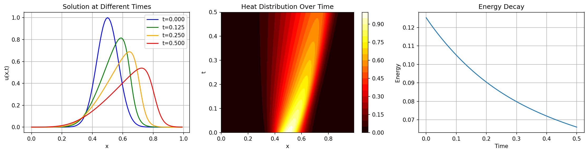
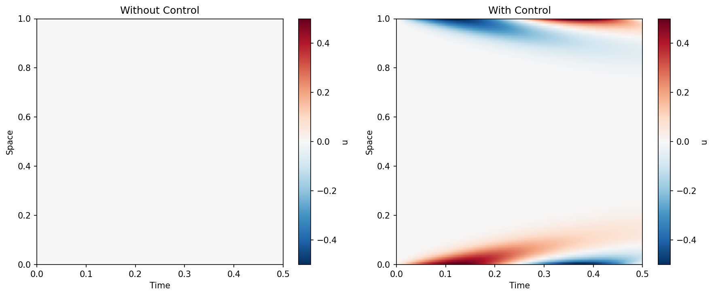
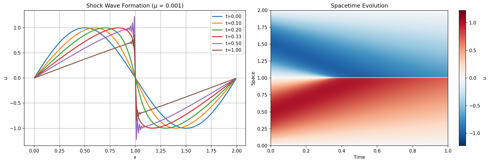

# 1D Viscous Burgers' Equation Solver (JAX Implementation)

A high-performance, JIT-compiled solver for the viscous Burgers' equation using JAX. This is a Python converted code of the original Julia implementation from [PolynomialModelReductionDataset.jl](https://github.com/smallpondtom/PolynomialModelReductionDataset.jl/blob/main/src/1D/Burgers.jl). For more details, see the [doc](https://smallpondtom.github.io/PolynomialModelReductionDataset.jl/stable/1D/burgers/).





## Equation

```plain
∂u/∂t = μ ∂²u/∂x² - u ∂u/∂x
```

Where:

- `u(x,t)` is the velocity field
- `μ` is the viscosity/diffusion coefficient
- The first term is diffusion (linear)
- The second term is nonlinear advection

## Features

✅ **Multiple Conservation Types:**

- **NC (Non-Conservative)**: Standard form `-u ∂u/∂x`
- **C (Conservative)**: Conservative form `-∂(u²/2)/∂x`
- **EP (Energy Preserving)**: Energy-preserving discretization

✅ **Boundary Conditions:**

- Periodic boundary conditions
- Dirichlet boundary conditions (with optional control)

✅ **Performance:**

- JIT-compiled with JAX for speed
- GPU-compatible (automatically uses GPU if available)
- Efficient sparse matrix operations

✅ **Easy Parameter Updates:**

- Update viscosity μ on the fly
- Operators automatically rebuild
- No need to recreate model

✅ **Control Inputs:**

- Support for boundary control in Dirichlet case
- Flexible control matrix structure

## Installation

```bash
pip install jax jaxlib numpy matplotlib
```

For GPU support:

```bash
pip install jax[cuda12]  # For CUDA 12
```

## Quick Start

### Basic Usage

```python
import jax.numpy as jnp
from burgers_jax import BurgersModel

# Create model
model = BurgersModel(
    spatial_domain=(0.0, 1.0),
    time_domain=(0.0, 0.5),
    dx=0.01,
    dt=0.001,
    diffusion_coeff=0.01,
    BC='periodic',
    conservation_type='NC'
)

# Initial condition: Gaussian bump
x = model.xspan
u0 = jnp.exp(-100 * (x - 0.5)**2)

# Solve
u = model.solve(u0)

print(f"Solution shape: {u.shape}")  # (N_x, N_t)
```

### Using Convenience Function

```python
from burgers_jax import solve_burgers

x, t, u = solve_burgers(
    spatial_domain=(0.0, 1.0),
    time_domain=(0.0, 0.5),
    dx=0.01,
    dt=0.001,
    mu=0.01,
    u0=u0,
    BC='periodic',
    conservation_type='NC'
)
```

### Parameter Updates

```python
# Create model
model = BurgersModel(..., diffusion_coeff=0.01)

# Solve with initial parameters
u1 = model.solve(u0)

# Update viscosity and resolve
model.update_parameters(mu=0.02)
u2 = model.solve(u0)  # Uses new viscosity

# Update again
model.update_parameters(mu=0.005)
u3 = model.solve(u0)
```

### With Control Input (Dirichlet BC)

```python
model = BurgersModel(
    spatial_domain=(0.0, 1.0),
    time_domain=(0.0, 0.5),
    dx=0.01,
    dt=0.001,
    diffusion_coeff=0.01,
    BC='dirichlet',
    conservation_type='NC'
)

# Control input at boundaries
# Shape: (num_inputs, N_t)
control = jnp.zeros((1, model.T))
control = control.at[0, :].set(0.5 * jnp.sin(2 * jnp.pi * model.tspan))

# Solve with control
u = model.solve(u0, control=control)
```

## API Reference

### BurgersModel Class

#### Constructor

```python
BurgersModel(
    spatial_domain: Tuple[float, float],
    time_domain: Tuple[float, float],
    dx: float,
    dt: float,
    diffusion_coeff: float,
    BC: Literal['periodic', 'dirichlet'] = 'dirichlet',
    conservation_type: Literal['NC', 'C', 'EP'] = 'NC'
)
```

**Parameters:**

- `spatial_domain`: (x_min, x_max) spatial extent
- `time_domain`: (t_min, t_max) temporal extent
- `dx`: Spatial grid spacing
- `dt`: Time step size
- `diffusion_coeff`: Viscosity parameter μ
- `BC`: Boundary condition type
- `conservation_type`: Form of nonlinear term

#### Methods

**`solve(u0, tspan=None, control=None)`**

Solve the Burgers' equation.

- `u0`: Initial condition, shape `(N,)`
- `tspan`: Time points (optional, uses `model.tspan` by default)
- `control`: Control input, shape `(num_inputs, N_t)` for Dirichlet BC
- **Returns**: Solution `u`, shape `(N, N_t)`

**`update_parameters(mu)`**

Update viscosity and rebuild operators.

- `mu`: New viscosity coefficient

#### Attributes

- `xspan`: Spatial grid points
- `tspan`: Temporal grid points
- `N`: Number of spatial points
- `T`: Number of time points
- `A`: Linear operator (diffusion)
- `F`: Quadratic operator (advection)
- `B`: Control operator (Dirichlet BC only)

### Conservation Types

| Type | Form | Description | Energy |
|------|------|-------------|--------|
| NC | `-u ∂u/∂x` | Standard non-conservative | Dissipates |
| C | `-∂(u²/2)/∂x` | Conservative form | Better mass conservation |
| EP | Mixed form | Energy-preserving discretization | Preserves energy better |

### Boundary Conditions

**Periodic:**

- `u(0, t) = u(L, t)`
- Suitable for wave-like phenomena
- No boundary control

**Dirichlet:**

- Fixed values at boundaries
- Supports control input
- Control matrix `B` available

## Examples

See `burgers_examples.py` for comprehensive examples:

1. **Basic periodic BC**: Gaussian bump evolution
2. **Dirichlet with control**: Boundary-driven flow
3. **Conservation comparison**: NC vs C vs EP
4. **Parameter sensitivity**: Effect of viscosity
5. **Shock formation**: Low viscosity shock waves
6. **Convenience function**: One-liner solving

Run examples:

```bash
pixi run python burgers_examples.py
```

## Mathematical Details

### Semi-Implicit Euler Integration

The solver uses a semi-implicit (or linearly implicit) Euler scheme:

```plain
(I - Δt A) u^{n+1} = u^n + Δt F(u^n ⊗ u^n) + Δt B c^{n+1}
```

Where:

- `A` is the linear (diffusion) operator
- `F` is the quadratic (advection) operator
- `⊗` denotes the unique Kronecker product
- `B` is the control operator (if applicable)
- `c` is the control input

This scheme:

- Treats diffusion implicitly (stable for large Δt)
- Treats advection explicitly (preserves nonlinearity)
- Requires solving a linear system at each step

### Unique Kronecker Product

For the quadratic term, we use a "unique" Kronecker product that avoids redundancy:

```plain
u ⊗ u = [u₁², u₁u₂, u₁u₃, ..., u₂², u₂u₃, ..., uₙ²]ᵀ
```

This has dimension `N(N+1)/2` instead of `N²`.

### Spatial Discretization

**Second-order central differences** for diffusion:

```plain
∂²u/∂x² ≈ (u_{i+1} - 2u_i + u_{i-1}) / Δx²
```

**Different schemes for advection** depending on conservation type:

- **NC**: `∂u/∂x ≈ (u_{i+1} - u_{i-1}) / (2Δx)`
- **C**: `∂(u²)/∂x ≈ (u²_{i+1} - u²_{i-1}) / (2Δx)`
- **EP**: Mixed form with 4 terms for energy preservation

## Performance Tips

1. **JIT Compilation**: First call is slow (compilation), subsequent calls are fast
2. **Batch Solving**: Use `jax.vmap` for multiple parameter sets
3. **GPU Usage**: JAX automatically uses GPU if available
4. **Memory**: Large grids may require significant memory for quadratic operator

## Limitations

- 1D spatial domain only
- Semi-implicit Euler (first-order in time)
- Uniform spatial grid
- Fixed time step

## References

1. Burgers, J. M. (1948). "A mathematical model illustrating the theory of turbulence"
2. Bateman, H. (1915). "Some recent researches on the motion of fluids"
3. Conservation forms: Tadmor, E. (1989). "Convergence of spectral methods for nonlinear conservation laws"

## License

MIT License

## Author

Converted from Julia to Python/JAX
